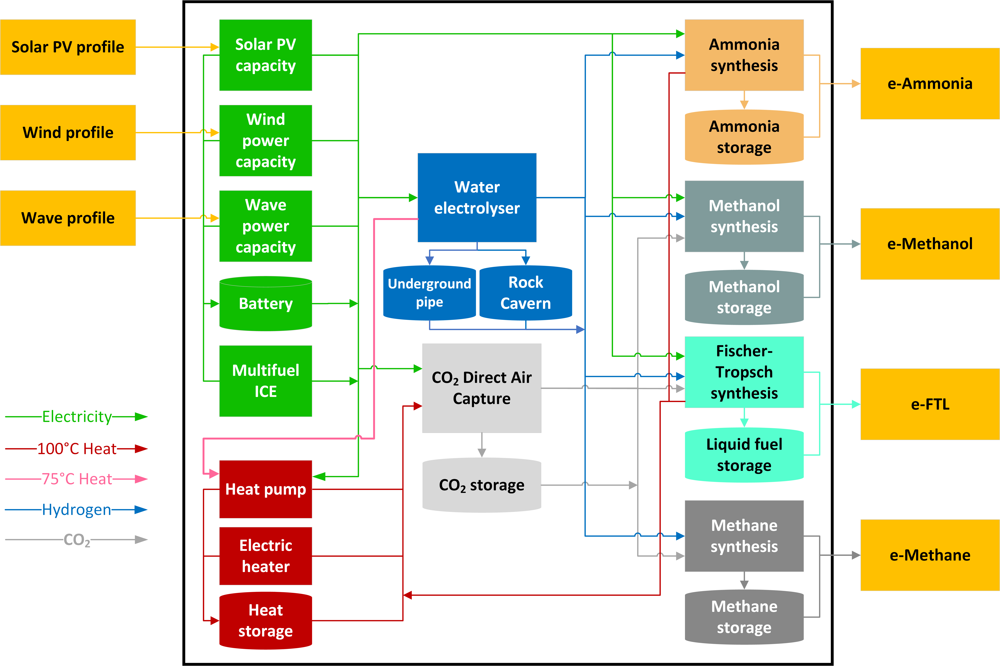

# energyHub-LUT

A MATLAB-based optimisation framework for designing and operating energy hubs that combine renewable energy sources with Power-to-X (PtX) technologies for synthetic fuel production.

## Features

- Integration of multiple renewable energy sources:
  - Wind power
  - Fixed-tilt and single-axis tracking PV systems
  - Wave power
- Power-to-X conversion pathways:
  - Ammonia synthesis
  - Methanation
  - Methanol synthesis
  - Fischer-Tropsch synthesis
- Energy storage systems:
  - Battery storage
  - Thermal energy storage
  - Hydrogen storage (rock cavern and underground pipe storage)
  - CO2 storage
  - Fuel storage systems for NH3, CH4, MeOH, and FT liquids
- Optimisation of:
  - Renewable energy capacities
  - Power-to-X conversion capacities
  - Storage system sizing

## Usage
The core of the project is the energyHub_LUT.m function. Before running the function, you need to prepare the input data:
- **profiles**: A structure containing hourly capacity factors for renewable energy sources. This typically includes 8760 data points for a full year.
  - profiles.wind: Wind power capacity factors [8760x1]
  - profiles.pvo: PV fixed-tilt capacity factors [8760x1]
  - profiles.pva: PV single-axis tracking capacity factors [8760x1]
  - profiles.wave: Wave power capacity factors [8760x1]
- **assumptionsTable**: A MATLAB table containing technology cost data, efficiencies, and technical parameters as in the "Financial and Technical Assumptions.xlsx" file
- **nh3_demand**: Annual ammonia demand [MWh/year]
- **ch4_demand**: Annual synthetic methane demand [MWh/year]
- **meoh_demand**: Annual methanol demand [MWh/year]
- **ft_demand**: Annual Fischer-Tropsch liquid demand [MWh/year]
- **wavePotential**: Maximum available wave energy capacity [MW]
- **landArea**: Available land area for onshore renewables [km²]

Example usage is shown in setup_energyHub_LUT.m file.

## Citing energyHub-LUT
If you use energyHub-LUT for your research, we would appreciate it if you would cite the following paper:

## License
energyHub-LUT is licensed under the open source MIT License.
